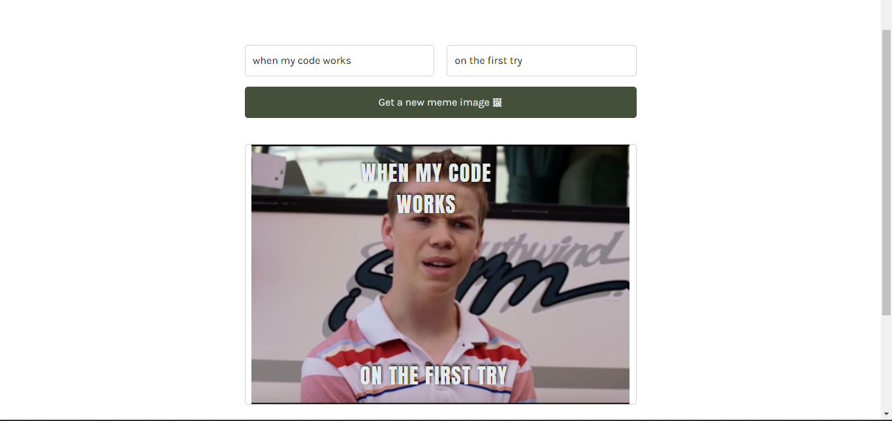

# Meme Generator

A meme generator that allows you to create memes from random images.

## Table of contents
- [Overview](#overview)
  - [About the project](#about-the-project)
  - [Stack](#stack)
- [Getting Started](#getting-started)
  - [Prerequisites](#prerequisites)
  - [Setting up locally](#setting-up-locally)
- [Contribution](#contribution)
- [Code of Conduct](#code-of-conduct)
- [Liscense](#liscense)


## Overview

### About the project

A web application that allows a user to create memes from random images by adding a top and bottom text to the image.


### Stack
- React
- SASS

## Getting Started

### Prerequesites
- [Nodejs and Node Package Manager(NPM)](https://nodejs.org/en/download/) to run commands and the application correctly.


### Setting up locally
Follow these steps to set up the project locally on your computer:

1. Open your terminal and clone the repository
```
git clone git@github.com:mbonamensa/meme_generator.git
```
You can find other ways of cloning repositories that work best for you [here](https://docs.github.com/en/repositories/creating-and-managing-repositories/cloning-a-repository)

2. Enter the project directory/folder
```
cd meme_generator
```

3. Install dependencies
```
npm install
```

4. Run the app in your browser
```
npm run dev
```

## Contribution
Any contribution you make to this project is highly appreciated and will not be taken for granted. To add your awesome knowledge and skills to this project, please make sure to read the [contribution guidelines](https://github.com/mbonamensa/meme_generator/blob/main/CONTRIBUTING.md) and create an [issue](https://github.com/mbonamensa/meme_generator/issues) first, before making a pull request.

## Code of Conduct
Please read the [Code of Conduct](https://github.com/mbonamensa/meme_generator/blob/main/CODE_OF_CONDUCT.md) to be aware of what is welcoming and what is not in your contribution to this project.

## Liscense
This project is under the [MIT License](https://github.com/mbonamensa/meme_generator/blob/main/LICENSE)


